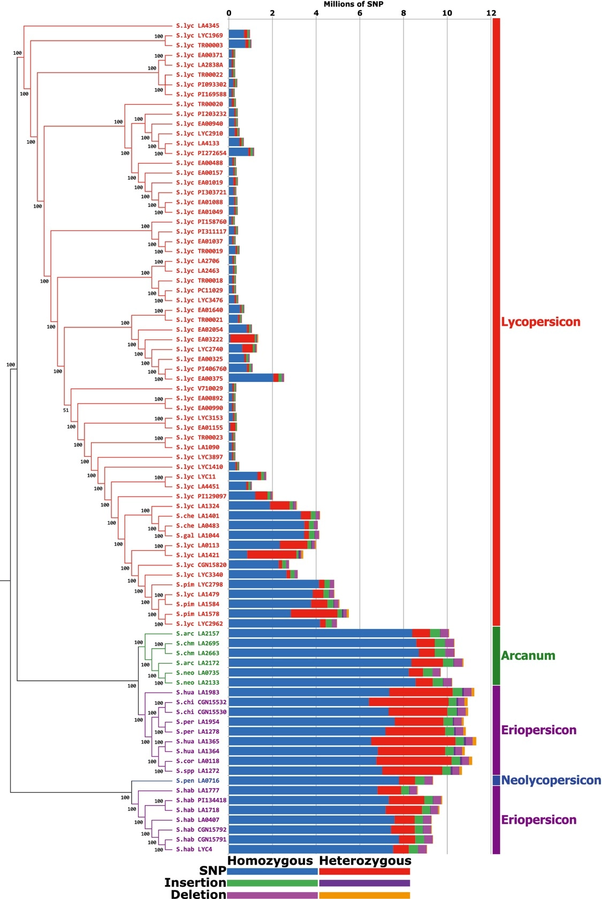

# kTom: kmers for profiling Tomato introgressions 

### Intro statement

Important traits for vegetable markets are often obtained by crossing elite breeding germplasm to wild vegetable lines that carry a trait of interest (for example, disease resistance or fruit flavor). The process of moving a genomic region from one species or distantly-related speices into another is called **introgression**. Genetic traits have been moved into cultivated tomatoes over the past several decades of tomato breeding.

Identifying and tracking introgressed traits in an important function of modern tomato breeding. Some introgressions can be completely defined by de novo sequencing and assembly, but this can be expensive or incomplete. Most marker sets today rely exclusively on SNPs, which don't always track diverse tomato genetics (Schouten, et al, 2019).

### What's the problem?

Mapping wild or landrace introgressions into elite germplasm is difficult because many of these traits introgress as large presence/absence structural variants with novel genes/sequences that make fine mapping difficult. 

Having a reference-free method to define introgression sequences will provide more agility to understand the nature of important traits (e.g. [Voicheck & Weigel, 2020](https://www.nature.com/articles/s41588-020-0612-7))

### Why should we solve it?

Using kmers (or any non-SNP approach) to tag introgressions would let us…

- Establish an orthologous fingerprint of introgressions across cultivated lines
- Investigate and viz the history of introgressions in a population
- Understand tomato population structure with a data type more able to account for SVs
- Form the basis for a kmerGWAS/SV-GWAS approach ([e.g. Voichek & Weigel, 2019](https://www.biorxiv.org/content/10.1101/818096v2))

## kmer snpshot tool

## Usage

* [main.sh](scripts/main.sh): run FastQC, trim, and generate kmers for a single sample.
* [read_kmer_fasta.py](scripts/read_kmer_fasta.py) Create kmer frequency matrix for the population.
* [kmer_heatmap.R](scripts/kmer_heatmap.R): vizualise kmer matrix.

### Data

- Paper: [Exploring genetic variation in the tomato clade by whole-genome sequencing, 100 Tomato Geome Sequencing(Consortium](https://onlinelibrary.wiley.com/doi/10.1111/tpj.12616)
- Data on [ERA](https://www.ebi.ac.uk/ena/browser/view/PRJEB5235?show=reads) or [SRA](https://www.ncbi.nlm.nih.gov/bioproject/PRJEB5235)

### Next steps

* Normalize FASTQ read depths 
* Consider different kmer size (k=21)
* Method for cleaning individual samples (e.g. remove kmers where n=1)
    - Also consider generating a "background Heinz" kmer profile to subtract from all new samples
* More efficient for tabulating kmer frequency in a population
	- Consider [Voicheck method](https://github.com/voichek/kmersGWAS/blob/master/manual.pdf)

#### Validation
* [Loci for validation](docs/TomatoHakathon_Validation.pptx)
* [Schouten, et al., 2019](https://www.frontiersin.org/articles/10.3389/fpls.2019.01606/full) defines several introgressions (in European culitvars) for disease resistance or quality traits.

